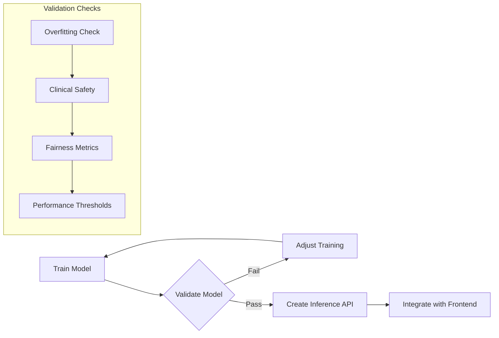

# Machine Learning Model Plan

This document outlines the implementation plan for the machine learning component of the Active Patient Follow-Up Alert Dashboard. The plan is structured in three sequential phases: Training, Validation, and Inference, with a strong emphasis on validation before proceeding to inference.

## Implementation Flow



## Directory Structure

```
src/
  training/         # Python training code
    __init__.py
    train.py        # Main training script
    preprocess.py   # Data transformation
    features.py     # Feature engineering
  validation/       # Validation utilities
    __init__.py
    validate.py     # Main validation script
    metrics.py      # Clinical metrics
    reports.py      # Report generation
  inference/        # API server
    __init__.py
    app.py          # FastAPI server
    schemas.py      # API request/response models
    model_handler.py # Model loading logic
model/              # Trained model artifacts (gitignored)
  version.txt       # Model version tracking
reports/            # Validation reports
  metrics/          # Performance metrics
  clinical/         # Clinical validation results
requirements.txt    # Python dependencies
```

## Phase 1: Training

### Data Loading and Preprocessing

```python
# src/training/preprocess.py
"""
1. Load JSON data from data/ directory
2. Parse patient records and test results
3. Handle missing values and outliers
4. Normalize values based on reference ranges
5. Create feature vectors for each patient
"""
```

### Feature Engineering

```python
# src/training/features.py
"""
1. Extract basic features:
   - Latest test values
   - Deviation from reference ranges
   - Rate of change between tests
2. Create derived features:
   - Composite risk indicators
   - Temporal patterns
   - Age/gender normalized values
3. Feature selection:
   - Remove highly correlated features
   - Rank by clinical relevance
"""
```

### Model Training

```python
# src/training/train.py
"""
1. Split data:
   - Training set (60%)
   - Validation set (20%)
   - Test set (20%)
2. Train multiple model types:
   - Logistic Regression (interpretable baseline)
   - Random Forest (robust performance)
   - XGBoost (high performance)
3. Hyperparameter tuning:
   - Grid search with cross-validation
   - Optimize for clinical metrics
4. Export model artifacts:
   - Serialized model
   - Preprocessing pipeline
   - Feature importance
   - Training metadata
"""
```

## Phase 2: Validation (Critical)

### Overfitting Detection

```python
# src/validation/validate.py
"""
1. Learning curve analysis:
   - Training vs. validation error
   - Sample size sensitivity
2. Feature importance stability:
   - Bootstrap resampling
   - Cross-validation consistency
3. Temporal validation:
   - Train on older data, test on newer
"""
```

### Clinical Safety Metrics

```python
# src/validation/metrics.py
"""
1. Sensitivity thresholds:
   - Minimum 95% for high-risk patients
   - Stratified by condition severity
2. False negative analysis:
   - Clinical impact assessment
   - Root cause categorization
3. Decision threshold optimization:
   - ROC curve analysis
   - Clinical cost function
"""
```

### Fairness and Bias Detection

```python
# src/validation/fairness.py
"""
1. Demographic parity:
   - Age group comparison
   - Gender comparison
2. Equal opportunity:
   - Similar recall across groups
3. Calibration analysis:
   - Confidence score reliability
"""
```

### Performance Requirements

```python
# src/validation/requirements.py
"""
Minimum thresholds for model acceptance:
1. AUC-ROC >= 0.85
2. Sensitivity >= 0.95
3. Specificity >= 0.70
4. F1 Score >= 0.80
5. No significant demographic bias (Δ < 0.1)
"""
```

### Validation Reports

```python
# src/validation/reports.py
"""
1. Generate comprehensive validation report:
   - Performance metrics
   - Clinical safety assessment
   - Fairness evaluation
   - Feature importance analysis
2. Model approval checklist:
   - All requirements met
   - No critical failures
   - Clinician review sign-off
"""
```

## Phase 3: Inference (After Validation)

### Model Serving

```python
# src/inference/model_handler.py
"""
1. Load approved model from model/ directory
2. Version checking and compatibility
3. Preprocessing pipeline integration
4. Batch prediction support
5. Confidence score calibration
"""
```

### API Schema

```python
# src/inference/schemas.py
"""
1. Request schema:
   - Patient ID
   - Test results
   - Optional context
2. Response schema:
   - Risk score
   - Confidence
   - Contributing factors
   - Recommended actions
"""
```

### FastAPI Server

```python
# src/inference/app.py
"""
1. RESTful endpoints:
   - POST /predict
   - GET /model-info
2. Middleware:
   - CORS for frontend
   - Authentication
   - Request validation
   - Rate limiting
3. Error handling:
   - Input validation
   - Model errors
   - Graceful degradation
"""
```

## Implementation Steps

1. **Setup Python Environment**
   ```bash
   # Create directories
   mkdir -p src/{training,validation,inference} model reports/{metrics,clinical}
   
   # Create Python package structure
   touch src/{training,validation,inference}/__init__.py
   
   # Setup requirements
   pip install scikit-learn pandas numpy fastapi uvicorn
   pip freeze > requirements.txt
   ```

2. **Training Implementation**
   ```bash
   # Generate training data (TypeScript)
   npx ts-node src/simulateData/cli.ts --patients 1000
   
   # Implement training scripts
   python -m src.training.train
   ```

3. **Validation Implementation**
   ```bash
   # Run validation suite
   python -m src.validation.validate
   
   # Generate validation report
   python -m src.validation.reports
   ```

4. **Inference Implementation (only after validation passes)**
   ```bash
   # Start API server
   python -m src.inference.app
   
   # Test API
   curl -X POST "http://localhost:8000/predict" -H "Content-Type: application/json" -d '{"patientId":"P-123"}'
   ```

5. **Integration with Frontend**
   ```typescript
   // Example frontend integration
   async function getPrediction(patientId: string) {
     const response = await fetch('http://localhost:8000/predict', {
       method: 'POST',
       headers: { 'Content-Type': 'application/json' },
       body: JSON.stringify({ patientId })
     });
     return await response.json();
   }
   ```

## Gitignore Updates

```
# Model artifacts
/model/*.pkl
/model/*.joblib
/model/experiments/

# Keep version tracking
!/model/version.txt

# Python
__pycache__/
*.py[cod]
*$py.class
.env
venv/

# Reports
/reports/metrics/*.json
/reports/clinical/*.json