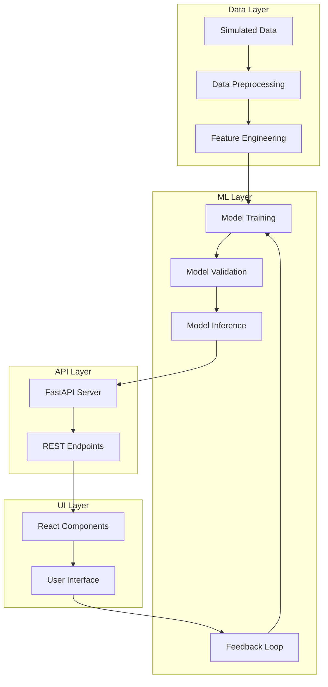

# System Patterns: Active Patient Follow-Up Alert Dashboard

## System Architecture

The Active Patient Follow-Up Alert Dashboard follows a modular, multi-tier architecture with clear separation of concerns:

## Key Components

### 1. Data Simulation Module

- **Purpose**: Generate synthetic blood test data for development and testing
- **Pattern**: Factory pattern for creating patient and test data
- **Key Files**: `src/simulateData/bloodTestGenerator.ts`, `src/simulateData/patientGenerator.ts`
- **Data Flow**: Generates patient profiles → Adds realistic blood test results → Applies reference ranges → Flags abnormalities

### 2. Machine Learning Pipeline

- **Purpose**: Train, validate, and serve predictions from ML models
- **Pattern**: Pipeline pattern with clear stages (preprocess → train → validate → serve)
- **Key Files**: `src/training/train.py`, `src/validation/validate.py`, `src/inference/model_handler.py`
- **Data Flow**: Preprocesses data → Engineers features → Trains multiple models → Validates for clinical safety → Serves predictions

### 3. Inference API

- **Purpose**: Provide REST endpoints for making predictions
- **Pattern**: API Gateway pattern with middleware for cross-cutting concerns
- **Key Files**: `src/inference/app.py`, `src/inference/schemas.py`
- **Data Flow**: Receives HTTP requests → Validates input → Calls model handler → Returns predictions

### 4. React Frontend

- **Purpose**: Provide user interface for entering test data and viewing predictions
- **Pattern**: Component-based architecture with state management
- **Key Files**: `src/ui/pages/TestEntry.tsx`, `src/ui/pages/Results.tsx`, `src/ui/stores/test.ts`
- **Data Flow**: Captures user input → Submits to API → Displays results → Collects feedback

## Key Technical Decisions

### 1. Separation of Training and Inference

**Decision**: Separate the model training pipeline from the inference API
**Rationale**:
- Enables independent scaling of training and inference
- Allows for offline training and online serving
- Supports the active learning loop with clear boundaries

### 2. Multiple Model Evaluation

**Decision**: Train and evaluate multiple model types (Logistic Regression, Random Forest)
**Rationale**:
- Logistic Regression provides interpretability
- Random Forest offers better performance
- Selection based on combined metrics prioritizing clinical safety

### 3. Comprehensive Validation Suite

**Decision**: Implement extensive validation checks before model deployment
**Rationale**:
- Clinical safety requires high confidence in model performance
- Fairness across demographics is essential for ethical deployment
- Temporal validation ensures stability over time

### 4. Effector for State Management

**Decision**: Use Effector for React state management
**Rationale**:
- Lightweight alternative to Redux
- Clear store/event/effect pattern
- Good TypeScript integration

### 5. FastAPI for Backend

**Decision**: Use FastAPI for the inference API
**Rationale**:
- Modern, high-performance Python web framework
- Built-in OpenAPI documentation
- Strong typing with Pydantic schemas

## Component Relationships

### Data Flow Relationships

1. **Data Generation → Training**:
   - Simulated data provides input for model training
   - Reference ranges inform feature engineering

2. **Training → Validation**:
   - Trained models undergo rigorous validation
   - Only models that pass validation proceed to inference

3. **Validation → Inference**:
   - Validated models are serialized and loaded by the inference API
   - Model metadata is preserved for transparency

4. **Inference → UI**:
   - API serves predictions to the frontend
   - Includes confidence scores and contributing factors

5. **UI → Feedback Loop**:
   - User feedback on predictions is collected
   - Feedback informs model retraining

### Cross-Cutting Concerns

1. **Type Sharing**:
   - TypeScript interfaces define data structures
   - Python Pydantic models ensure API schema consistency

2. **Error Handling**:
   - Consistent error patterns across components
   - Graceful degradation when components fail

3. **Logging and Monitoring**:
   - Structured logging throughout the system
   - Performance metrics for key operations

## Design Patterns

1. **Factory Pattern** (Data Simulation):
   - Creates complex objects with consistent structure
   - Encapsulates creation logic

2. **Pipeline Pattern** (ML Training):
   - Sequential processing stages
   - Clear data transformations

3. **Repository Pattern** (Model Storage):
   - Abstracts storage and retrieval of model artifacts
   - Handles versioning and metadata

4. **Strategy Pattern** (Model Selection):
   - Encapsulates different algorithms
   - Allows runtime selection based on performance

5. **Observer Pattern** (UI State Management):
   - Components observe state changes
   - Reactive updates to UI