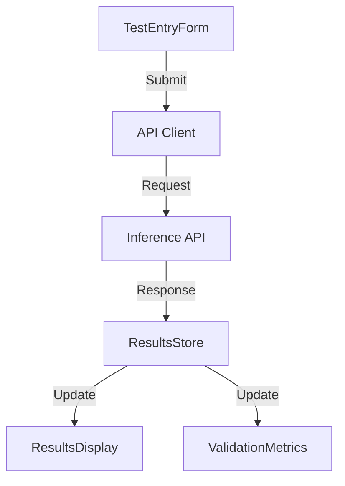

# RN Blood Test Interface - UI Implementation Plan

## Overview

This document outlines the implementation plan for a user interface that allows Registered Nurses (RNs) to enter blood test results and view model predictions. The interface will be built using Vite, React, TypeScript, and TanStack Router.

## Technology Stack

- **Build Tool**: Vite
- **Framework**: React 18+
- **Language**: TypeScript
- **Routing**: TanStack Router
- **State Management**: Effector (as per project conventions)
- **Styling**: CSS Modules
- **API Integration**: Fetch API with TypeScript types

## Project Structure

```
src/ui/
├── components/           # Reusable UI components
│   ├── common/           # Generic components (buttons, inputs, etc.)
│   ├── layout/           # Layout components
│   └── domain/           # Domain-specific components
├── pages/                # Page components
│   ├── Home.tsx          # Landing page
│   ├── TestEntry.tsx     # Test entry form
│   └── Results.tsx       # Results display
├── api/                  # API integration
│   ├── client.ts         # API client
│   └── types.ts          # API types (derived from shared types)
├── stores/               # Effector stores
│   ├── test.ts           # Test data store
│   └── results.ts        # Results store
├── routes.ts             # TanStack Router configuration
├── App.tsx               # Main application component
└── main.tsx              # Entry point
```

## Component Architecture

### Key Components

1. **TestEntryForm**
   - Form for entering blood test results
   - Validation for required fields and numeric ranges
   - Submit button to send data to API

2. **ResultsDisplay**
   - Display prediction results (normal/abnormal)
   - Confidence score visualization
   - Risk score display
   - Top contributing factors

3. **ValidationMetrics**
   - Display model validation metrics
   - Confidence intervals
   - Performance thresholds

### Data Flow



## API Integration

### Types

We will reuse and adapt types from `src/shared/types.ts` and align with the API schemas in `src/inference/schemas.py`:

```typescript
// Simplified test entry form data
interface TestFormData {
  patientId: string;
  age?: number;
  gender?: 'M' | 'F';
  testId: string;
  testDate: string;
  hemoglobin: number;
  hemoglobinMin: number;
  hemoglobinMax: number;
  wbc: number;
  wbcMin: number;
  wbcMax: number;
  // ... other test fields
}

// API request format
interface PredictionRequest {
  patient: {
    patientId: string;
    age?: number;
    gender?: string;
    tests: [{
      testId: string;
      testDate: string;
      hemoglobin: number;
      hemoglobinMin: number;
      hemoglobinMax: number;
      // ... other test fields
    }]
  }
}

// API response format
interface PredictionResponse {
  patientId: string;
  prediction: 'NORMAL' | 'ABNORMAL';
  probability: number;
  confidence: number;
  risk_score: number;
  top_contributors: Array<{
    feature: string;
    value: number;
    contribution: number;
    is_abnormal: boolean;
  }>;
  model_version: string;
  timestamp: string;
}
```

### API Client

```typescript
// src/ui/api/client.ts
export async function predictAbnormality(formData: TestFormData): Promise<PredictionResponse> {
  const response = await fetch('http://localhost:8000/predict', {
    method: 'POST',
    headers: {
      'Content-Type': 'application/json',
    },
    body: JSON.stringify({
      patient: {
        patientId: formData.patientId,
        age: formData.age,
        gender: formData.gender,
        tests: [{
          testId: formData.testId,
          testDate: formData.testDate,
          hemoglobin: formData.hemoglobin,
          hemoglobinMin: formData.hemoglobinMin,
          hemoglobinMax: formData.hemoglobinMax,
          // ... other test fields
        }]
      }
    }),
  });

  if (!response.ok) {
    throw new Error(`API error: ${response.status}`);
  }

  return response.json();
}
```

## UI/UX Design Principles

### Layout

- Clean, clinical interface with clear visual hierarchy
- Responsive design for desktop and tablet use
- Two main sections: test entry and results display

### Form Design

- Grouped fields by test category
- Inline validation with error messages
- Reference range inputs alongside test values
- Clear submission button

### Results Display

- Color-coded results (red for abnormal, green for normal)
- Confidence visualization (progress bar or gauge)
- Risk score prominently displayed
- Collapsible sections for detailed information

### Validation Metrics

- Dashboard-style cards for key metrics
- Visual indicators for threshold compliance
- Confidence intervals displayed as ranges

## Implementation Roadmap

### Phase 1: Project Setup

1. Initialize Vite project with React and TypeScript
2. Set up TanStack Router
3. Configure CSS Modules
4. Set up Effector for state management
5. Create basic project structure

### Phase 2: Core Components

1. Implement TestEntryForm component
2. Create form validation logic
3. Implement API client
4. Create basic results display

### Phase 3: Enhanced UI

1. Implement detailed results display
2. Add validation metrics visualization
3. Improve styling and responsiveness
4. Add error handling and loading states

### Phase 4: Testing and Refinement

1. Test with sample data
2. Optimize performance
3. Refine UI based on feedback
4. Add documentation

## Development Setup

```bash
# Create project
npm create vite@latest anima-ui -- --template react-ts

# Install dependencies
cd anima-ui
npm install
npm install @tanstack/react-router
npm install effector effector-react

# Start development server
npm run dev
```

## Integration with Backend

The UI will connect to the FastAPI backend running on `http://localhost:8000`. The API endpoints used will be:

- `POST /predict` - Submit test results and get predictions
- `GET /model-info` - Get information about the current model

## Next Steps

After implementing the basic UI, potential enhancements could include:

1. Saving test results for future reference
2. Batch upload capability
3. Visualization of test trends over time
4. Integration with EMR systems